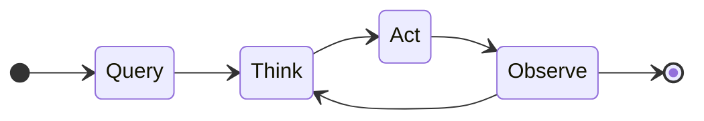

+++
date = '2025-08-25T10:40:48-04:00'
draft = true
title = 'Hugging face agents'
tags = ["llm", "agents", "ai", "hugging face", "smolagents"]
[cover]
image = "cover.jpg"
caption = "Agent by [Nick Youngson](http://www.nyphotographic.com/) CC BY-SA 3.0 Pix4free"
+++

I've been doing the hugging face agents course

## First agent using smolagents

I'll be using `uv` to manage the dependencies for this tutorial, so if you don't
have it already go ahead and install it following the
[installation steps](https://docs.astral.sh/uv/getting-started/installation/)
first.



Create a new project and add the required dependencies:

```shell
uv init ai-agent
cd ai-agent
uv add smolagents[openai,toolkit]
```

Update your `main.py` file

```python
import math
from smolagents import CodeAgent, WebSearchTool, OpenAIServerModel, tool


@tool
def distance(point1: tuple[float, float], point2: tuple[float, float]) -> float:
    """
    Haversine formula to calculate distance between two points on Earth

    Args:
        point1: a tuple containing the latitude and longitude of point 1 in decimal format
        point2: a tuple containing the latitude and longitude of point 2 in decimal format
    Output:
        Returns the distance in km between the 2 points.
    """

    # Convert decimal degrees to radians
    lat1, lon1, lat2, lon2 = map(math.radians, [*point1, *point2])

    # Haversine formula
    dlat = lat2 - lat1
    dlon = lon2 - lon1
    a = (
        math.sin(dlat / 2) ** 2
        + math.cos(lat1) * math.cos(lat2) * math.sin(dlon / 2) ** 2
    )
    c = 2 * math.asin(math.sqrt(a))

    # Radius of earth in kilometers
    r = 6371

    return c * r


model = OpenAIServerModel(
    api_base="http://localhost:11434/v1",
    model_id="qwen3-coder:30b",
    api_key="ollama",
)

agent = CodeAgent(tools=[WebSearchTool(), distance], model=model)

res = agent.run("""
    I want to calculate the distance between Toronto and New York City.
    - You should find the geo coordinates for Toronto
    - Find the geo coordinates for New York City
    - Calculate the distance between those 2 coordinates
""")
```

Let me breakdown the code:

- imports
- tool definition
- Model API
- Instantiate agent
- run with the prompt

Execute the file by running:

```shell
uv run main.py
```

Example output:

```text
╭─────────────────────────────────── New run ────────────────────────────────────╮
│                                                                                │
│ I want to calculate the distance between Toronto and New York City.            │
│     - You should find the geo coordinates for Toronto                          │
│     - Find the geo coordinates for New York City                               │
│     - Calculate the distance between those 2 coordinates                       │
│                                                                                │
╰─ OpenAIServerModel - qwen3-coder:30b ──────────────────────────────────────────╯
```

```text
━━━━━━━━━━━━━━━━━━━━━━━━━━━━━━━━━━━━━ Step 1 ━━━━━━━━━━━━━━━━━━━━━━━━━━━━━━━━━━━━━
 ─ Executing parsed code: ───────────────────────────────────────────────────────
  toronto_coords = web_search(query="Toronto latitude longitude")
  print("Toronto coordinates:", toronto_coords)
 ────────────────────────────────────────────────────────────────────────────────
Execution logs:
Toronto coordinates: ## Search Results

[Latitude and longitude of Toronto, Canada - GPS
Coordinates](https://latlong.info/canada/ontario/toronto)
What is the latitude and longitude code of Toronto ? The latitude of Toronto ,
Canada is 43.70011000, and the longitude is -79.41630000. Toronto is located at
Canada country in the states place category with the gps coordinates of 43° 42'
0.396'' N and -79° 24' 58.68 E. Geographic coordinates are a way of specifying the
location of a place on Earth, using a pair of numbers to represent a ...

(more results) ...

Out: None
[Step 1: Duration 4.40 seconds| Input tokens: 2,110 | Output tokens: 77]
━━━━━━━━━━━━━━━━━━━━━━━━━━━━━━━━━━━━━ Step 2 ━━━━━━━━━━━━━━━━━━━━━━━━━━━━━━━━━━━━━
 ─ Executing parsed code: ───────────────────────────────────────────────────────
  nyc_coords = web_search(query="New York City latitude longitude")
  print("New York City coordinates:", nyc_coords)
 ────────────────────────────────────────────────────────────────────────────────
Execution logs:
New York City coordinates: ## Search Results

[New York City Latitude and Longitude Map - Maps of
World](https://www.mapsofworld.com/lat_long/new-york-city.html)
 Latitude and longitude of New  York  City is 40.71278 N and -74.00594 E. Map
showing the geographic coordinates of New  York  City , in United States.

(more results) ...

Out: None
[Step 2: Duration 4.79 seconds| Input tokens: 5,342 | Output tokens: 127]
```

On steps 1 and 2, the agent uses the `web_search` tool to crawl the web and look
for the geographic coordinates for the two cities of interest.

```text {hl_lines=[5,8,9,10]}
━━━━━━━━━━━━━━━━━━━━━━━━━━━━━━━━━━━━━ Step 3 ━━━━━━━━━━━━━━━━━━━━━━━━━━━━━━━━━━━━━
 ─ Executing parsed code: ───────────────────────────────────────────────────────
  toronto = (43.70011, -79.4163)
  nyc = (40.712775, -74.005973)
  distance = distance(toronto, nyc)
  print("Distance between Toronto and New York City:", distance, "km")
 ────────────────────────────────────────────────────────────────────────────────
Code execution failed at line 'distance = distance(toronto, nyc)' due to:
InterpreterError: Cannot assign to name 'distance': doing this would erase the
existing tool!
[Step 3: Duration 7.77 seconds| Input tokens: 9,382 | Output tokens: 231]
```

Armed with the coordinates, the agent now tries to use the provided `distance`
tool to perform the calculation. Pay close attention to the highlighted lines
though. The agent made a mistake when naming the variable that and the python
parser complained about it. This gets corrected on the next step. That speaks to
the ability of the agent loop to self correct and find the right answer. As long
as you provide the correct feedback mechanisms.

```text
━━━━━━━━━━━━━━━━━━━━━━━━━━━━━━━━━━━━━ Step 4 ━━━━━━━━━━━━━━━━━━━━━━━━━━━━━━━━━━━━━
 ─ Executing parsed code: ───────────────────────────────────────────────────────
  toronto = (43.70011, -79.4163)
  nyc = (40.712775, -74.005973)
  distance_result = distance(toronto, nyc)
  print("Distance between Toronto and New York City:", distance_result, "km")
 ────────────────────────────────────────────────────────────────────────────────
Execution logs:
Distance between Toronto and New York City: 555.6065996863686 km

Out: None
[Step 4: Duration 9.93 seconds| Input tokens: 12,736 | Output tokens: 348]
```

The correct code is now executed and the final answer is found.

```text
━━━━━━━━━━━━━━━━━━━━━━━━━━━━━━━━━━━━━ Step 5 ━━━━━━━━━━━━━━━━━━━━━━━━━━━━━━━━━━━━━
 ─ Executing parsed code: ───────────────────────────────────────────────────────
  final_answer(555.61)
 ────────────────────────────────────────────────────────────────────────────────
Final answer: 555.61
[Step 5: Duration 2.67 seconds| Input tokens: 16,369 | Output tokens: 396]
```

## Conclusion

- External tools
- Multi step approach
- Agent self correction
- Code agents vs tool agents
