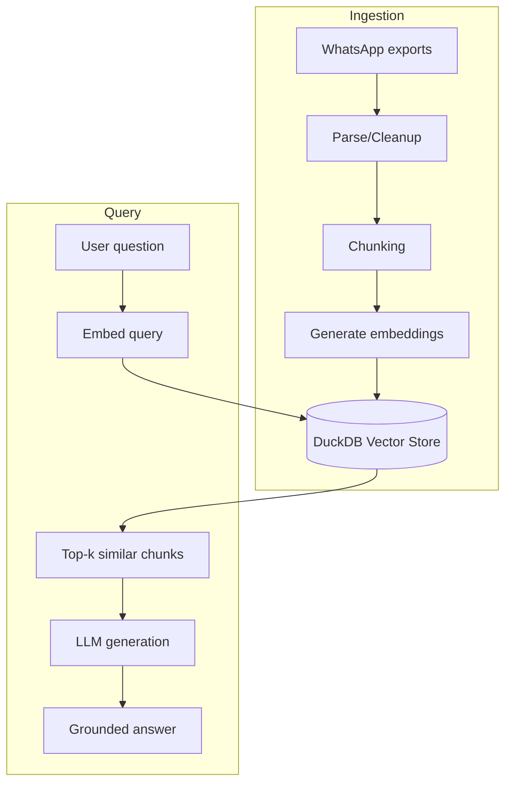

+++
title = "Ask your WhatsApp: build a private RAG with LlamaIndex"
draft = true
date = '2025-09-02T20:46:38-04:00'
tags = ["llamaindex", "rag", "whatsapp", "privacy", "ai", "duckdb"]
[cover]
image = "zaprag.svg"
+++

## Why build a WhatsApp RAG?

I have a very active group chat with my friends on WhatsApp. At the time of
writing, it is a bit over half a million messages. Since LLMs became a thing, I
always wondered how I could use this data to something useful—or at the very
least, prank my friends.

Last year I tried a few different approaches to fine tune a model using the chat
data, but I didn't work all that well. Fine tuning a model on commodity hardware
is a challenge in itself and the results were underwhelming. So I dropped that
idea for a while. While going through the material for the
[HuggingFace Agents Course](https://huggingface.co/learn/agents-course/unit2/llama-index/components)
though, it became very clear that RAG (Retrieval Augmented Generation) would be
a perfect fit for what I was trying to do.

This post shows how easy it is to set up a RAG on top of your WhatsApp chat
logs. You are going to export your messages, parse the .txt files, index them
with LlamaIndex, generate embeddings and store them to DuckDB, and ask questions
locally running Ollama. You’ll end with a small chat application that you can
talk and ask questions about your conversation log. The best part is that
everything can run from your local machine, so you don't have to upload any of
this sensitive data to cloud providers.

## Rag, embeddings, and vector databases

Before diving in the implementation, here are some definitions of key concepts
used in this experiment:

- RAG: Retrieval‑Augmented Generation; first retrieves relevant chunks from your
  data, then generates an answer grounded in those snippets.
- Embeddings: Numeric vector representations of text; semantically similar texts
  map to nearby vectors, enabling semantic similarity search.
- Vector database: A store/index optimized for embeddings and fast similarity
  search (e.g., retrieving the top‑k most relevant chunks). Here LlamaIndex’s
  DuckDB vector store is used to persist vectors locally.

This is what the workflow looks like once fully implemented:



## Prerequisites

- Python 3.10+
- One or more WhatsApp chat exports in `.txt` format
- [`ollama`](https://ollama.com/download) running a local model (e.g., `llama3`
  or `gpt-oss`)
- [`uv`](https://docs.astral.sh/uv/getting-started/installation/) to manage
  Python dependencies

Create a new project using `uv` and add the dependencies:

```shell
uv init whatsapp-rag
cd whatsapp-rag
uv add \
  llama-index-llms-ollama \
  llama-index-vector-stores-duckdb \
  llama-index-embeddings-huggingface \
  gradio
```

## Export your chats

Create a new directory for the chat data inside your project:

```shell
mkdir input
```

You need to export your chat messages to a text file.

- iOS: Chat → Contact info → Export Chat → Without Media → Save/Share .txt
- Android: Chat → More → Export chat → Without media
- Name each file clearly: `family.txt`, `work.txt`, etc., and place them in the
  `./input` folder.

## Ingest chat logs

Create a new file named `ingest.py` and populate with this content:

```python
from llama_index.core import SimpleDirectoryReader, StorageContext, VectorStoreIndex
from llama_index.core.node_parser import TokenTextSplitter
from llama_index.embeddings.huggingface import HuggingFaceEmbedding
from llama_index.vector_stores.duckdb import DuckDBVectorStore


vector_store = DuckDBVectorStore("duck.db", persist_dir="./data/")
storage_context = StorageContext.from_defaults(vector_store=vector_store)
embed_model = HuggingFaceEmbedding(model_name="BAAI/bge-m3")

splitter = TokenTextSplitter(chunk_size=512, separator="\r\n")

documents = SimpleDirectoryReader("./input/").load_data()

index = VectorStoreIndex.from_documents(
    documents,
    storage_context=storage_context,
    transformations=[splitter],
    embed_model=embed_model,
    show_progress=True,
)
```

The script loads your exported `.txt` chats, splits them into retrieval‑friendly
chunks, calculates the embeddings, and persists everything to DuckDB:

- Vector store: `DuckDBVectorStore("duck.db", persist_dir="./data/")` stores
  both vectors and metadata on disk under `./data/`, so you can reuse the index
  without re‑ingesting.
- Embeddings: `BAAI/bge-m3` is a strong multilingual embedding model that runs
  locally via Hugging Face. You can swap it for a smaller/faster model if
  needed.
- Chunking: `TokenTextSplitter(chunk_size=512, separator="\r\n")` breaks the raw
  chat text along line breaks, keeping messages together while limiting token
  length for better retrieval.
- Reader: `SimpleDirectoryReader("./input/")` loads every `.txt` file in the
  folder and attaches basic file metadata (e.g., filename).
- Index build: `VectorStoreIndex.from_documents(...)` generates embeddings for
  each chunk and writes them to DuckDB with progress reporting.

After running this once, the built index is persisted and can be opened later
for querying without reprocessing the input files.

To run the script you can use this command:

```shell
uv run ingest.py
```

## Main chat app

Next, you have the actual RAG application that uses the index generated on the
previous step.

```python
import gradio
from llama_index.core import VectorStoreIndex
from llama_index.core.prompts import ChatMessage
from llama_index.embeddings.huggingface import HuggingFaceEmbedding
from llama_index.llms.ollama import Ollama
from llama_index.vector_stores.duckdb import DuckDBVectorStore

embed_model = HuggingFaceEmbedding(model_name="BAAI/bge-m3", device="cpu")
vector_store = DuckDBVectorStore.from_local("./data/duck.db")
index = VectorStoreIndex.from_vector_store(vector_store, embed_model=embed_model)


llm = Ollama(
    model="gpt-oss:20b",
    request_timeout=300,
    context_window=1024 * 10,
)

engine = index.as_chat_engine(
    llm=llm,
    similarity_top_k=5,
    system_prompt=(
        "You are a helpful assistant that searches WhatsApp "
        "messages to answer questions"
    ),
    streaming=True,
)


def stream(input: str, history: list[dict[str, str]]):
    chat_history = [
        ChatMessage(role=item["role"], content=item["content"]) for item in history
    ]
    content = ""
    for token in engine.stream_chat(input, chat_history=chat_history).response_gen:
        content += token
        yield content


chat = gradio.ChatInterface(
    fn=stream,
    type="messages",
    title="RacinhoGPT",
).launch()
```

This file wires the stored index to an LLM and a simple chat UI:

- Embed model: here the embedding model is loaded on the CPU to save VRAM for
  the LLM model. Also, only the user's prompt needs to be processed so using the
  GPU won't give you a lot of performance improvements.
- Load index: `DuckDBVectorStore.from_local("./data/duck.db")` reopens the
  previously persisted vectors, and `VectorStoreIndex.from_vector_store(...)`
  prepares a retriever over them using the same embedding model.
- Local LLM: `Ollama(model="gpt-oss:20b")` runs a local model for generation.
  You can replace it with another Ollama model (e.g., `llama3`) if preferred.
  Make sure to configure an appropriate context window that fits in your
  hardware budget. I'm using a GeForce RTX 4060Ti 16 GB, so 10k was the right
  number to fit the model, system prompt, the RAG context, and the user prompt.
- Chat engine: `index.as_chat_engine(...)` handles retrieval‑augmented
  generation with `top_k=5` similar chunks and a concise system prompt.
- Streaming: `engine.stream_chat(...)` yields tokens as they are generated; the
  `stream` function accumulates and streams them back to Gradio for a live UI.
- History: Incoming `history` messages are converted to `ChatMessage`s so the
  LLM can keep context across turns.
- UI: `gradio.ChatInterface` provides a minimal chat app you can open in the
  browser. Title is arbitrary—rename freely.

```shell
uv run main.py
```

Once launched, type a question like “Is there any discussions of a ski trip?”
and the assistant retrieves relevant messages from your chats and answer
grounded on those snippets.

## Where to go from here

Here are some ideas on how to improve on this example:

- Play around with different LLM and embedding models.
- Tune the `system_prompt`, `chunk_size`, `top_k`, and the `context_window`
  values according to your hardware, and compare which combination deliver the
  most reliable results.
- Turn the application into an agent. So far, the application only one-shots the
  model with the appropriate context. You can improve its results by using an
  agentic loop to retrieve the information. This can be achieved by transforming
  the query engine into a tool using the `QueryEngineTool` and `AgentWorkflow`
  classes both from LlamaIndex.

## Wrap‑up

With a few dozen lines of parsing and LlamaIndex’s indexing/query APIs, you get
a private, semantic interface to your WhatsApp history. This example is also not
limited to WhatsApp chats, you can easily adapt to other file formats using
LlamaIndex provided
[parsers](https://docs.llamaindex.ai/en/stable/module_guides/loading/node_parsers/modules/).
I highly recommend checking it out.
